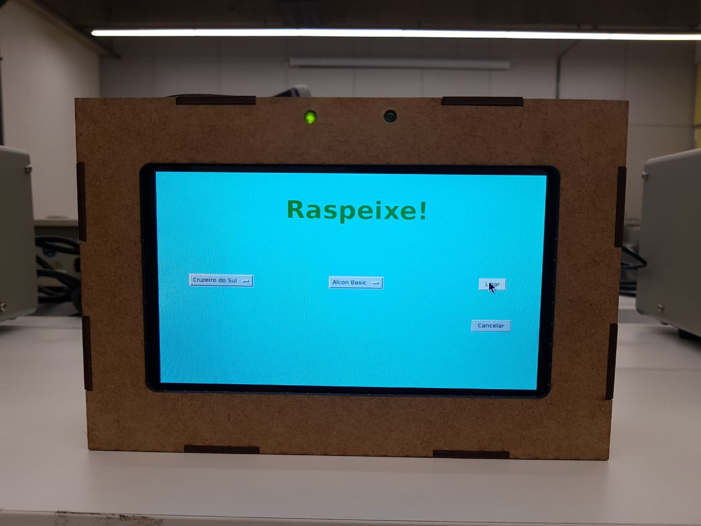

# Raspeixe
Trabalho Micro controladores
Vinicius Yamane 16.02248-3, Willian Bazilio 16.00831-6

  O Raspeixe é um projeto destinado à criadores de peixes interessados na automação da alimentação e iluminação do seu aquário
  Descrição: O projeto será controlado por um display LCD de 7 polegadas touchscreen, onde o usuário poderá escolher o tipo de peixe e
  o tipo de comida que será utilizado para alimentar seu peixe. Ápos feitas as escolhas e confirmando, um motor despeja comida e luzes são
  acessas, durante um certo período. 
  
  ---
  # Implementação IOT
  
  A partir da implementação do IOT é possível bloquear a utilização do dispositivo de usuários inadimplentes.
  Link do dashboard disponível para o administrador:
  
  [Ubidots Dashboard](  https://industrial.ubidots.com/app/dashboards/5da77194642ab62e4c7ca08f/)

